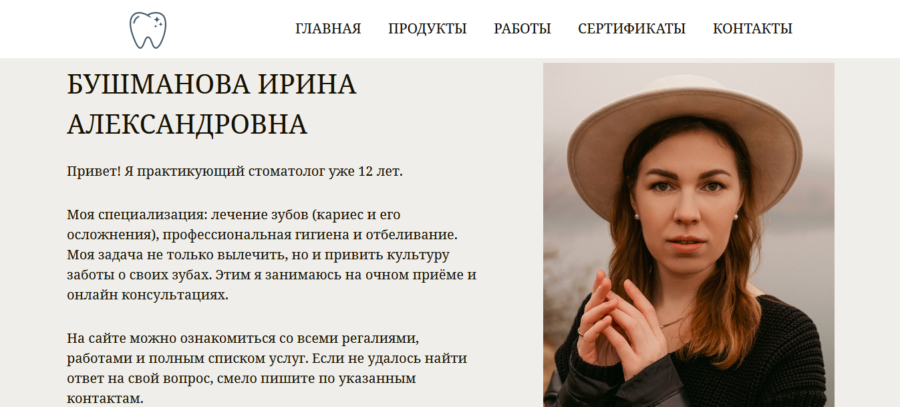
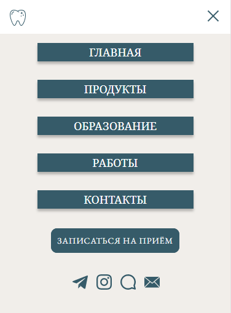
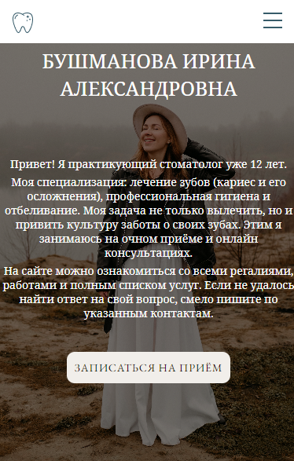

<h1 align="center">Сайт Стоматолога</h1>

## Включает в себя:
* Главная страница
* Страничка с продуктами
* Страничка с примерами работ
* Страничка с сертификатами
* Страничка с контактами

## Используемые технологии:
* HTML
* CSS
* Bootstrap
* Адаптивная вёрстка
* Респансивная вёрстка
* Figma
* Методология БЭМ
* SASS

## Уникальные фишки:

* Адаптивный дизайн для экранов мобильных телефонов и компьютеров
* Раскрывающийся список меню для мобильной версии сайта

* Реализация слайдер-галлереи 
* Анимация
* Первый блок на главной странице сделан в 2-х разных дизайнах: для компьютерной и мобильной версий.
  * _Компьютерная версия_: блок с текстом, фото и кнопка с анимацией синего цвета
  * _Мобильная версия_: фото используется в качестве фонового изображения, а текстовый блок находится на нём, кнопке присвоен белый цвет.

* На главной странице для демонстрации блока с примерами работ используется картинка-превью, представляющая из себя коллаж, кликнув по которой можно перенестись на страницу со всеми работами. Также под картинкой оставлена кнопка, которую будет удобно использовать в мобильной версии сайта.
* На странице с контактами ознакомиться с информацией можно в текстовой форме, а также кликнув по иконкам соцсетей и перейдя непосредственно на сторонние источники. А кликнув по карте, перейти в гугл карты с уже выведенным адресом, где проходит очный приём.

___

___

### _Авторы:_
[Елена Турленко](https://github.com/elenaturlenko) 
[Алексеева Анастасия]() 
[Глебова Любовь](https://github.com/glebishna) 
[Кармолина Елизавета](https://github.com/RenHayakawa) 
[Оксана Травкина](https://github.com/ryaba-ya) 
[Мария Желонкина](https://github.com/Marysemm) 
[Юлия Перекрестова](https://github.com/JuliaMichaela) 

